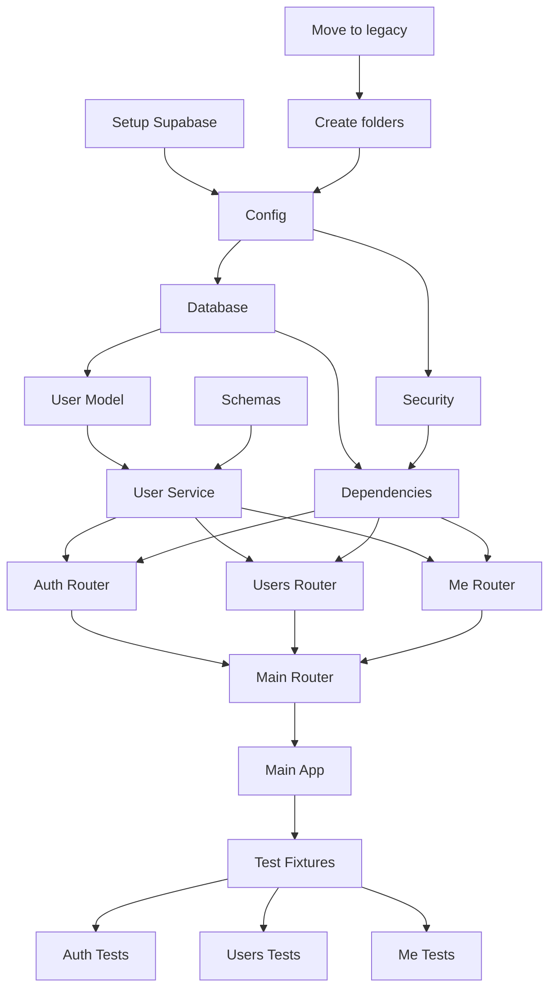

# Plan: Refactorización API Recetario - Arquitectura por Capas

## Overview

**Objetivo:** Refactorizar la API de usuarios de estructura plana a arquitectura por capas, aplicando buenas prácticas de desarrollo profesional.

**Tipo de Proyecto:** BACKEND (API REST)

**Decisiones Confirmadas:**
| Aspecto | Decisión |
|---------|----------|
| Base de datos | PostgreSQL en Supabase |
| Endpoints | Completo: `/auth`, `/users`, `/me` |
| Tests | Suite completa (unit + integration) |
| Archivos originales | Mover a `legacy/` |

---

## Success Criteria

- [ ] API arranca sin errores con Supabase
- [ ] Todos los endpoints funcionan en Swagger UI
- [ ] Tests pasan al 100%
- [ ] Estructura de carpetas profesional
- [ ] Variables de entorno seguras (no secrets en código)

---

## Tech Stack

| Componente | Tecnología | Versión |
|------------|------------|---------|
| Framework | FastAPI | 0.128+ |
| ORM | SQLAlchemy | 2.0+ |
| Validación | Pydantic | 2.0+ |
| Auth | python-jose + passlib | Latest |
| DB | PostgreSQL (Supabase) | 15+ |
| Tests | pytest + httpx | Latest |
| Config | pydantic-settings | Latest |

---

## File Structure (Target)

```
recetario/
├── app/
│   ├── __init__.py
│   ├── main.py                 # Entry point
│   │
│   ├── core/                   # Configuración y utilidades core
│   │   ├── __init__.py
│   │   ├── config.py           # Settings con pydantic-settings
│   │   ├── database.py         # Engine, SessionLocal, get_db
│   │   ├── security.py         # JWT + password hashing
│   │   └── exceptions.py       # Custom exceptions
│   │
│   ├── models/                 # SQLAlchemy models
│   │   ├── __init__.py
│   │   └── user.py
│   │
│   ├── schemas/                # Pydantic schemas
│   │   ├── __init__.py
│   │   ├── user.py
│   │   └── token.py
│   │
│   ├── services/               # Business logic
│   │   ├── __init__.py
│   │   └── user_service.py
│   │
│   └── api/                    # Routers
│       ├── __init__.py
│       ├── deps.py             # Dependencies (get_db, get_current_user)
│       └── v1/
│           ├── __init__.py
│           ├── router.py       # Agrupa routers
│           ├── auth.py
│           ├── users.py
│           └── me.py
│
├── tests/
│   ├── __init__.py
│   ├── conftest.py             # Fixtures compartidos
│   ├── test_auth.py
│   ├── test_users.py
│   └── test_me.py
│
├── legacy/                     # Archivos originales (referencia)
│   ├── config.py
│   ├── models.py
│   ├── schemas.py
│   ├── jwt.py
│   ├── userService.py
│   ├── login_router.py
│   ├── user_router.py
│   └── me_router.py
│
├── .env                        # Variables de entorno (NO COMMITEAR)
├── .env.example                # Template de .env
├── .gitignore
├── requirements.txt
└── README.md
```

---

## Task Breakdown

### Phase 1: Preparación

#### Task 1.1: Mover archivos a legacy
- **Agent:** backend-specialist
- **Priority:** P0 (blocker)
- **INPUT:** Archivos en raíz
- **OUTPUT:** Archivos en `legacy/`
- **VERIFY:** `ls legacy/` muestra 8 archivos

#### Task 1.2: Crear estructura de carpetas
- **Agent:** backend-specialist
- **Priority:** P0
- **Dependencies:** Task 1.1
- **INPUT:** Ninguno
- **OUTPUT:** Carpetas `app/`, `tests/` con `__init__.py`
- **VERIFY:** Estructura existe

#### Task 1.3: Configurar Supabase
- **Agent:** backend-specialist
- **Priority:** P0
- **Dependencies:** Ninguna (paralelo con 1.1)
- **INPUT:** Cuenta Supabase del usuario
- **OUTPUT:** URL de conexión en `.env`
- **VERIFY:** Conexión exitosa

---

### Phase 2: Core Layer

#### Task 2.1: Config con pydantic-settings
- **Agent:** backend-specialist
- **Priority:** P1
- **Dependencies:** Task 1.2
- **INPUT:** `.env` con DATABASE_URL, SECRET_KEY
- **OUTPUT:** `app/core/config.py`
- **VERIFY:** `from app.core.config import settings` funciona

#### Task 2.2: Database module
- **Agent:** backend-specialist
- **Priority:** P1
- **Dependencies:** Task 2.1
- **INPUT:** Settings
- **OUTPUT:** `app/core/database.py` con engine, get_db
- **VERIFY:** Conexión a Supabase exitosa

#### Task 2.3: Security module
- **Agent:** backend-specialist
- **Priority:** P1
- **Dependencies:** Task 2.1
- **INPUT:** Settings (SECRET_KEY)
- **OUTPUT:** `app/core/security.py` con JWT + bcrypt
- **VERIFY:** Token encode/decode funciona

#### Task 2.4: Exceptions module
- **Agent:** backend-specialist
- **Priority:** P2
- **Dependencies:** Ninguna
- **INPUT:** Ninguno
- **OUTPUT:** `app/core/exceptions.py`
- **VERIFY:** Exceptions importables

---

### Phase 3: Models & Schemas

#### Task 3.1: User model
- **Agent:** backend-specialist
- **Priority:** P1
- **Dependencies:** Task 2.2
- **INPUT:** Model de legacy
- **OUTPUT:** `app/models/user.py`
- **VERIFY:** Tabla creada en Supabase

#### Task 3.2: User schemas
- **Agent:** backend-specialist
- **Priority:** P1
- **Dependencies:** Ninguna (paralelo)
- **INPUT:** Schemas de legacy
- **OUTPUT:** `app/schemas/user.py` + `token.py`
- **VERIFY:** Validación funciona

---

### Phase 4: Services

#### Task 4.1: User service
- **Agent:** backend-specialist
- **Priority:** P1
- **Dependencies:** Task 3.1, 3.2
- **INPUT:** userService de legacy
- **OUTPUT:** `app/services/user_service.py`
- **VERIFY:** CRUD funciona

---

### Phase 5: API Layer

#### Task 5.1: Dependencies
- **Agent:** backend-specialist
- **Priority:** P1
- **Dependencies:** Task 2.2, 2.3
- **INPUT:** Ninguno
- **OUTPUT:** `app/api/deps.py`
- **VERIFY:** get_db, get_current_user funcionan

#### Task 5.2: Auth router
- **Agent:** backend-specialist
- **Priority:** P1
- **Dependencies:** Task 5.1, 4.1
- **INPUT:** login_router de legacy
- **OUTPUT:** `app/api/v1/auth.py`
- **VERIFY:** POST /auth/token funciona

#### Task 5.3: Users router
- **Agent:** backend-specialist
- **Priority:** P1
- **Dependencies:** Task 5.1, 4.1
- **INPUT:** user_router de legacy
- **OUTPUT:** `app/api/v1/users.py`
- **VERIFY:** GET/POST /users funciona

#### Task 5.4: Me router
- **Agent:** backend-specialist
- **Priority:** P1
- **Dependencies:** Task 5.1, 4.1
- **INPUT:** me_router de legacy
- **OUTPUT:** `app/api/v1/me.py`
- **VERIFY:** GET/PUT/DELETE /me funciona

#### Task 5.5: Main router aggregator
- **Agent:** backend-specialist
- **Priority:** P1
- **Dependencies:** Task 5.2, 5.3, 5.4
- **INPUT:** Todos los routers
- **OUTPUT:** `app/api/v1/router.py`
- **VERIFY:** Routers incluidos

#### Task 5.6: Main app
- **Agent:** backend-specialist
- **Priority:** P1
- **Dependencies:** Task 5.5
- **INPUT:** main.py de legacy
- **OUTPUT:** `app/main.py`
- **VERIFY:** `uvicorn app.main:app --reload` arranca

---

### Phase 6: Tests

#### Task 6.1: Test fixtures
- **Agent:** backend-specialist
- **Priority:** P2
- **Dependencies:** Phase 5 completa
- **INPUT:** Ninguno
- **OUTPUT:** `tests/conftest.py`
- **VERIFY:** Fixtures disponibles

#### Task 6.2: Auth tests
- **Agent:** backend-specialist
- **Priority:** P2
- **Dependencies:** Task 6.1
- **INPUT:** Auth router
- **OUTPUT:** `tests/test_auth.py`
- **VERIFY:** `pytest tests/test_auth.py` pasa

#### Task 6.3: Users tests
- **Agent:** backend-specialist
- **Priority:** P2
- **Dependencies:** Task 6.1
- **INPUT:** Users router
- **OUTPUT:** `tests/test_users.py`
- **VERIFY:** `pytest tests/test_users.py` pasa

#### Task 6.4: Me tests
- **Agent:** backend-specialist
- **Priority:** P2
- **Dependencies:** Task 6.1
- **INPUT:** Me router
- **OUTPUT:** `tests/test_me.py`
- **VERIFY:** `pytest tests/test_me.py` pasa

---

### Phase 7: Documentation & Cleanup

#### Task 7.1: Update requirements.txt
- **Agent:** backend-specialist
- **Priority:** P1
- **INPUT:** Nuevas dependencias
- **OUTPUT:** `requirements.txt` actualizado
- **VERIFY:** `pip install -r requirements.txt` exitoso

#### Task 7.2: Create .env.example
- **Agent:** backend-specialist
- **Priority:** P1
- **INPUT:** Variables usadas
- **OUTPUT:** `.env.example`
- **VERIFY:** Archivo existe sin secrets

#### Task 7.3: Update .gitignore
- **Agent:** backend-specialist
- **Priority:** P1
- **INPUT:** Actual .gitignore
- **OUTPUT:** `.gitignore` con .env, __pycache__, etc.
- **VERIFY:** `.env` no trackeado

#### Task 7.4: Update README
- **Agent:** backend-specialist
- **Priority:** P3
- **INPUT:** Proyecto finalizado
- **OUTPUT:** `README.md` completo
- **VERIFY:** Instrucciones claras

---

## Phase X: Verification Checklist

- [ ] `uvicorn app.main:app --reload` arranca sin errores
- [ ] Swagger UI accesible en `/docs`
- [ ] POST `/auth/token/form` retorna JWT
- [ ] GET `/users` con token funciona
- [ ] POST `/users` crea usuario
- [ ] GET `/me` retorna usuario actual
- [ ] PUT `/me` actualiza usuario
- [ ] DELETE `/me` elimina usuario
- [ ] `pytest tests/ -v` pasa al 100%
- [ ] No hay secrets hardcodeados
- [ ] `.env` en `.gitignore`

---

## Dependency Graph



---

## Estimated Time

| Phase | Tasks | Time |
|-------|-------|------|
| Phase 1 | 3 | ~10 min |
| Phase 2 | 4 | ~15 min |
| Phase 3 | 2 | ~10 min |
| Phase 4 | 1 | ~10 min |
| Phase 5 | 6 | ~25 min |
| Phase 6 | 4 | ~20 min |
| Phase 7 | 4 | ~10 min |
| **Total** | **24 tasks** | **~100 min** |
